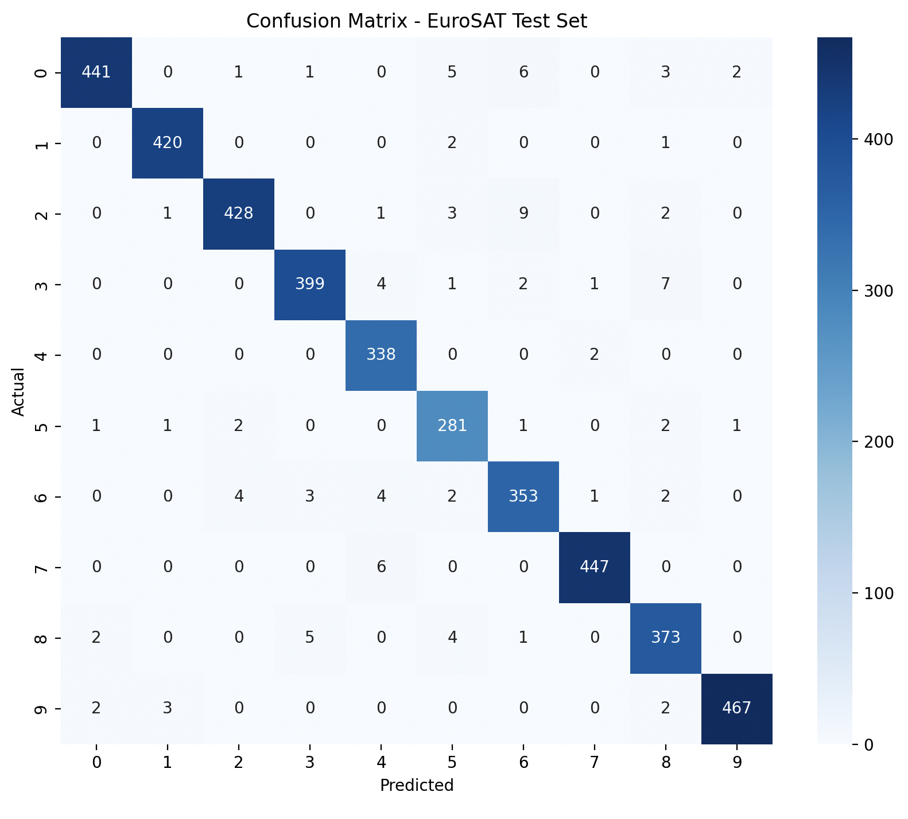

# EuroSAT Image Classification Pipeline

[](https://www.python.org/downloads/)
[](https://pytorch.org/)
[](https://opensource.org/licenses/MIT)

An end-to-end computer vision pipeline for land cover classification using the **EuroSAT (RGB)** dataset. This project implements a Convolutional Neural Network (CNN) designed to categorize satellite imagery into 10 distinct environmental classes.

---

## Project Overview

The goal of this project is to automate the classification of satellite images to assist in land use monitoring. Leveraging a custom CNN architecture, the pipeline handles everything from data augmentation and GPU-accelerated training (including Apple Silicon MPS support) to detailed performance evaluation.

### The Dataset
The **EuroSAT** dataset consists of 27,000 labeled RGB images (64x64 pixels) covering 10 classes:
* **Natural:** Forest, Herbaceous Vegetation, Lake, River, Sea & Ocean.
* **Urban/Agri:** Highway, Industrial, Pasture, Permanent Crop, Residential.


---

## Model Architecture

The model is built using PyTorch with the following layers:
* **Feature Extractor:** 3 Convolutional blocks, each followed by ReLU activation and MaxPool2D.
* **Classifier:** * Flattening layer ($128 \times 8 \times 8$)
    * Fully Connected layer (256 units) with ReLU.
    * **Dropout (0.5)** to mitigate overfitting.
    * Output layer (10 classes) with Softmax.
* **Hardware Acceleration:** Integrated support for **MPS (Metal Performance Shaders)** for Mac M1/M2/M3 chips, CUDA for NVIDIA GPUs, and standard CPU fallback.

---

## Data Processing & Training

### Preprocessing
* **Normalization:** Applied using `mean=(0.5, 0.5, 0.5)` and `std=(0.5, 0.5, 0.5)`.
* **Augmentation (Training only):** * Random Horizontal Flips.
    * Random Rotations ($\pm 20^{\circ}$).
* **Data Split:** 70% Train | 15% Validation | 15% Test.

### Training Hyperparameters
| Parameter | Value |
| :--- | :--- |
| **Optimizer** | Adam |
| **Loss Function** | CrossEntropyLoss |
| **Batch Size** | 32 |
| **Epochs** | 10 (Default) |
| **Learning Rate** | 0.001 |

---

## 📂 Repository Structure

```text
ImageClassificationPipeline/
├── data/               # Downloaded EuroSAT dataset
├── src/
│   ├── model.py        # CNN Architecture definition
│   ├── train.py        # Training and validation loops
│   ├── evaluate.py     # Inference and metrics generation
│   └── prepare_dataset.py # Dataset download, Setup, transformations and DataLoader logic
├── requirements.txt    # Project dependencies
└── README.md           # Project documentation
```

## Evaluation & Results

After training, the model is evaluated on the unseen test set to ensure its generalizability. We use a combination of global metrics and per-class analysis to understand the model's performance.

### Performance Summary
| Metric | Score |
| :--- | :--- |
| **Test Accuracy** | 97% |
| **Weighted Precision** | 0.97 |
| **Weighted Recall** | 0.97 |
| **Weighted F1-Score** | 0.97 |

> **Note:** Trained with 50 epoch

### Confusion Matrix
The confusion matrix helps identify specific "confusion" between similar classes, such as *River* and *Highway*, or *Pasture* and *Meadow*.


*Figure 1: Confusion Matrix generated during the evaluation phase, trained with 50 epoch.*


---

### Getting Started

Follow these steps to set up and run the pipeline on your local machine.

### 1. Installation & Environment
Clone the repository and create a dedicated virtual environment:

```bash
# Clone the repository
git clone <your-repo-url>
cd ImageClassificationPipeline


# Setup virtual environment
python3.10 -m venv venv
source venv/bin/activate  # On Windows: venv\Scripts\activate

# Install dependencies
pip install -r requirements.txt
```

### 2. Prepare the Dataset
Run the preparation script to download the **EuroSAT (RGB)** dataset and organize the directory structure. This script ensures that all images are correctly placed in the `data/` folder for the pipeline to access.

```bash
python src/prepare_dataset.py
```

### 3. Training the Model
Run the training script to start the optimization process. The pipeline includes a validation loop at the end of each epoch to monitor for overfitting. It automatically detects and utilizes **MPS (Metal Performance Shaders)** on Mac M-series, **CUDA** on NVIDIA GPUs, or **CPU** as a fallback.

```bash
python src/train.py
```

### 4. Final Evaluation
Once training is complete, run the evaluation script to calculate metrics on the test set.
```bash
python src/evaluate.py
```
```bash
Output Example:
Dataset size: 27000 images
Train: 18900, Validation: 4050, Test: 4050
Train batch: 591, Validation batch: 127, Test batch: 127
                      precision    recall  f1-score   support

          AnnualCrop       0.99      0.96      0.97       459
              Forest       0.99      0.99      0.99       423
HerbaceousVegetation       0.98      0.96      0.97       444
             Highway       0.98      0.96      0.97       414
          Industrial       0.96      0.99      0.98       340
             Pasture       0.94      0.97      0.96       289
       PermanentCrop       0.95      0.96      0.95       369
         Residential       0.99      0.99      0.99       453
               River       0.95      0.97      0.96       385
             SeaLake       0.99      0.99      0.99       474

            accuracy                           0.97      4050
           macro avg       0.97      0.97      0.97      4050
        weighted avg       0.97      0.97      0.97      4050
```

---

## Tech Stack & Dependencies

The pipeline is built with **Python 3.10** and leverages the following industry-standard libraries:

* **Deep Learning:** `torch`, `torchvision` (PyTorch ecosystem)
* **Data Analysis:** `numpy`, `scikit-learn`
* **Visualization:** `matplotlib`, `seaborn` (for confusion matrices and loss curves)
* **Utilities:** `tqdm` (progress bars), `Pillow` (image processing)

To ensure a consistent environment, install all dependencies via:

```bash
pip install -r requirements.txt
```

---

## Key Features

* **Multi-Device Acceleration:** Automatically detects and utilizes **Apple Silicon (MPS)**, **NVIDIA (CUDA)**, or CPU for optimal training speed.
* **Advanced Augmentation:** Implements random horizontal flips and rotations ($\pm 20^{\circ}$) to enhance model robustness and prevent overfitting.
* **Modular Architecture:** Organized into distinct scripts for data loading, model definition, training, and evaluation for easy maintenance.
* **Detailed Analytics:** Provides per-class performance metrics (Precision, Recall, F1-Score) and visual confusion matrices to identify classification bottlenecks.

---

## 📜 License

Distributed under the **MIT License**. See the `LICENSE` file for more information.

---

**Developed by:** Leonardo Magaraggia 
**GitHub:** [@leonardomagaraggia](https://github.com/leonardomagaraggia)  
**Project Link:** [https://github.com/leonardomagaraggia/ImageClassificationPipeline](https://github.com/leonardomagaraggia/EuroSAT-Image-Classification-Pipeline)
